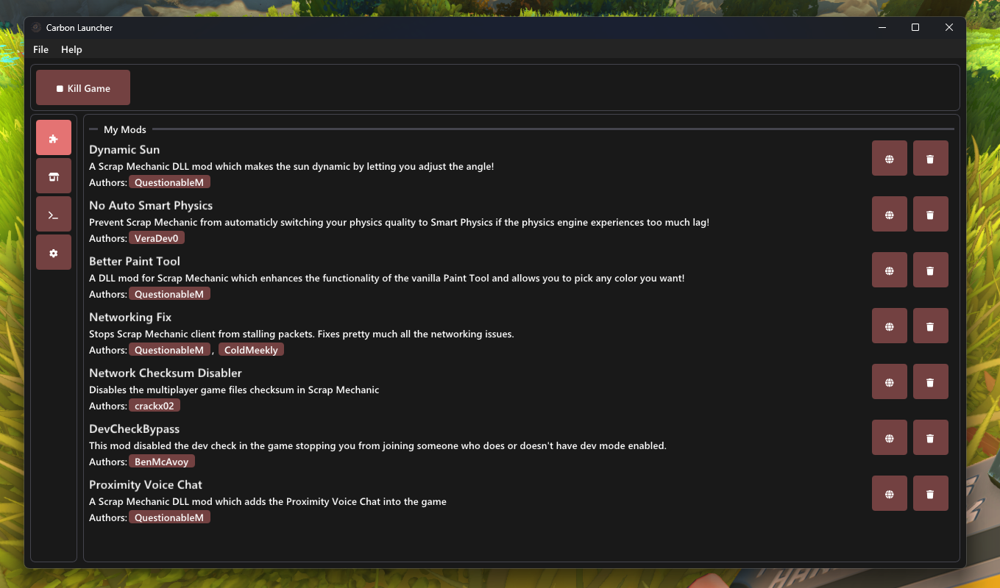

# Carbon Launcher

> [!WARNING]
> This is v1, it is being deprecated as the [v2 branch](https://github.com/ScrappySM/CarbonLauncher/tree/v2) is being worked on so please do not expect updates here (unless they are major issues)

**Carbon Launcher** is a powerful and user-friendly modding launcher for [Scrap Mechanic](https://www.scrapmechanic.com/), designed to support DLL mods and provide cloud synchronization for an enhanced modding experience. With Carbon Launcher, players can seamlessly download and manage DLL mods from a variety of online repositories, creating a vast library of modding content directly accessible from the launcher.

Whether you're a veteran modder or a newcomer, Carbon Launcher simplifies the process of discovering, installing, and managing mods with automatic updates and a streamlined user interface.

## Features

- **Seamless Installation & Uninstallation:** Installing mods is as simple as a few clicks, and removing them is just as easy.
- **Auto-Updates:** Mods are kept up to date with minimal effort. Any new versions or updates from the repository are automatically fetched and installed.
- **Community Support:** Participate in the growing modding community by submitting your own mods, or use the launcher to browse and contribute to shared content.
- **Game console forwarding:** Launch the game and watch it's output flow through the launcher allowing you to spot any issues with mods even if the game closes immediately.

## Installation

### Prerequisites

- Visual C++ Redistrutables
- OpenGL support

### Steps to Install:

1. **Download** the latest release of Carbon Launcher from [here](https://github.com/ScrappySM/CarbonLauncher/releases/latest).
2. **Extract** the downloaded zip file to a desired location on your system.
3. Run **CarbonLauncher.exe** to start the application.

## Contributing

**Carbon Launcher** is an open-source project, and contributions are welcome!

If you’d like to contribute, here’s how:

### Reporting Issues
If you encounter any bugs or have suggestions, feel free to open an issue in the issue tracker on GitHub.

### Getting your mod added
Open an issue [here](https://github.com/ScrappySM/CarbonRepo/issues) with the following information:
- **Mod Name:** The name of your mod.
- **Mod Description:** A brief description of your mod.

Some requirements for your mod:
- It **must** have it's DLLs as a release on GitHub and it must be published by a GitHub action. (this is to make malware less likely)
- By extension of the above, it **must** be open source.

Some recommendations for your mod:
- Your mod has a `manifest.json` file, an example one can be found [here](https://github.com/ScrappySM/ModTemplate/blob/main/manifest.json).
- Provide information on how to update your mod if applicable, an example can be found [here](https://github.com/ScrappySM/DevCheckBypass/blob/main/dllmain.cpp).

### Ideas & Improvements
We encourage feedback and suggestions. If you have any ideas for new features or improvements, please open an issue and share your thoughts!

## Known Issues

- **Compatibility:** Some mods may not be compatible with certain game versions. Most mods will simply tell you this when you start the game, just be patient and wait for the modders to update their mods, thanks!

## License

Carbon Launcher is open source and distributed under the [MIT License](LICENSE).

## Acknowledgements

- Thanks to all contributors for their hard work and dedication.
- Special thanks to the Scrap Mechanic modding community for their continued support and creativity.
