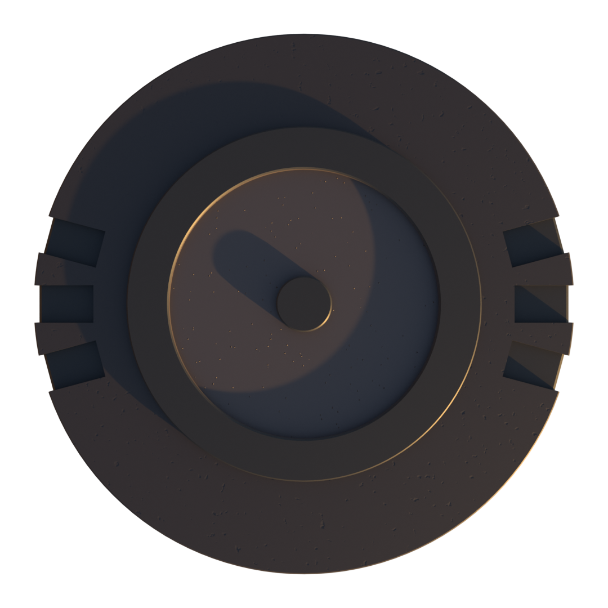

  

  <h3 align="center">Carbon Launcher</h3>

  

    The most advanced mod loader for Scrap Mechanic as of 2025.
     
    <a href="https://github.com/ScrappySM/CarbonLauncher/releases"><strong>« Download »</strong></a>
     
     
    <a href="https://github.com/ScrappySM/CarbonLauncher/releases">Releases</a>
    ·
    <a href="https://github.com/ScrappySM/CarbonLauncher/issues">Report Bugs</a>
    ·
    <a href="https://github.com/ScrappySM/CarbonLauncher/issues">Request Features</a>
  

## Why?

I believe Carbon Launcher to be a necessary step in Scrap Mechanic's modding community. The current modding experience in game is too sandboxed and so DLL modding was introduced. However, DLL modding in itself should be done with caution and is highly fragmented in it's current state. Carbon Launcher aims to provide a safe and incredibly user friendly experience for modding Scrap Mechanic with DLL mods.

What is a DLL mod, why do we want them? DLL mods are mods that are written in a language like C++ and are injected into the game at runtime. This allows for a much wider range of mods to be created, and allows for mods to be much more powerful than they would be if they were written in LUA like the games official modding API. Please note, this is not endorsed by Axolot Games and is not supported by them. Use at your own risk. However, DLL modding has great benefits as they can modify the engine itself, and can be used to create mods that would be impossible with the games official modding API (for example, [QuestionableM](https://github.com/QuestionableM)'s [proximity voice chat](https://github.com/QuestionableM/SM-ProximityVoiceChat) mod which allows players to talk to each other in game based on their proximity to each other). These are substantial mods that can also fix problems with the game, and can be used to create mods that are much more performant than LUA mods. However, since these mods are usually developed on sites such as GitHub, there is no centralised place to download them from, no management of security, and no way to automatically update them. Carbon Launcher aims to solve these problems and more.

## Features

Carbon Launcher is a mod loader for Scrap Mechanic. As of 2025, it is the most advanced mod loader for the game.

- **Downloading mods** - Download mods from a curated repository in a single click.
- **Updating mods** - Carbon Launcher automatically checks for updates and will prompt you to update mods when a new version is available.
- **Mod stability** - Carbon Launcher waits for the game to load all the way until the main menu before it injects any mods into the game. This ensures that mods are loaded at the correct time and reduces the chance of crashes.
- **Curated mods** - Carbon Launcher only allows mods that have been approved by the community to be uploaded to the repository. This ensures that mods are safe to use and won't break your game or harm your computer.
- **Mod dependencies** - Carbon Launcher automatically downloads and installs dependencies for mods. This means that you don't have to worry about finding and installing dependencies yourself.
- **Game console** - Carbon Launcher hooks the game console and will display it in the launcher. This allows you to see any errors that are thrown by the game or by mods even if the game hard crashes.

## Installation

Download the latest version of Carbon Launcher from the [releases page](https://github.com/ScrappySM/CarbonLauncher/releases) and run the installer. Follow the on-screen instructions

## Usage

1. Open Carbon Launcher
2. Downlod some mods! (press the download button next to any mods in the discovery list.
3. Launch the game using the "Launch" button in the top left.

## Contributing

If you would like to contribute to Carbon Launcher, please read the [CONTRIBUTING.md](CONTRIBUTING.md) file.

## License

Carbon Launcher is licensed under the MIT License. See the [LICENSE](LICENSE) file for more information.

